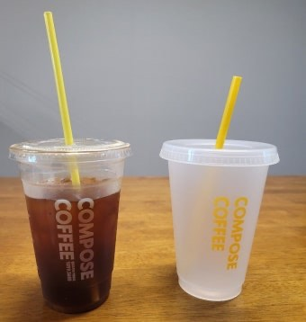
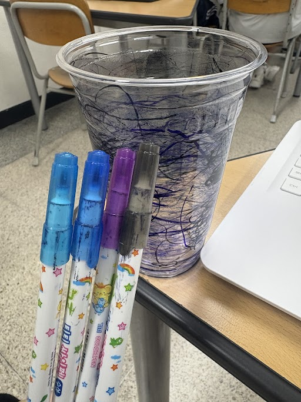
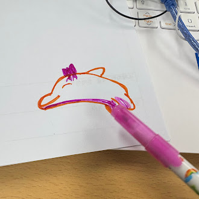
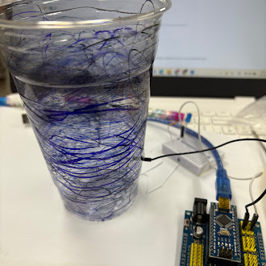
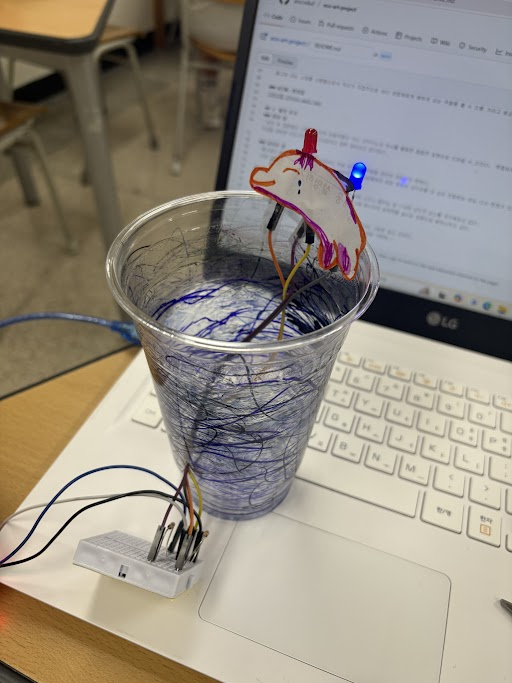

  # 🌱 에코아트 프로젝트: [깜깜한 바닷 속 돌고래가 보내는 위험신호]

## 📖 프로젝트 개요
- **제작자**: [20212문태영]
- **제작일**: [25.07.16]
- **소개**
> 「깜깜한 바닷속, 돌고래가 보내는 위협신호」는 해양 생태계가 보내는 마지막 경고를 형상화한 작품이다.
우리는 일상 속에서 플라스틱을 쉽게 쓰고 버리지만,
그 끝은 결국 바다로 흘러가 누군가의 삶을 무너뜨린다.
이 작품은 쓰레기로 가득 찬 바닷속에서 보이지 않게 고통받는 생명들,
그중에서도 ‘돌고래’를 상징으로 삼아 침묵 속에서 보내는 구조 신호를 표현한 설치 작업이다.
작품에는 아두이노와 LED, 온도센서를 활용해
환경 변화에 반응하는 ‘경고등’의 개념을 넣었고,
브레드보드, 플라스틱 조각 등 재활용 재료를 사용해
단순한 조형을 넘어 직접적인 실천의 의미까지 담아냈다.

## 📦 사용 재료
- 아두이노, 온도센서, LED, 브레드보드
- 페트병, 그림

## 🔧 제작 과정

### 1단계: 아이디어 스케치

-투명하지 않고 검정색이 된 바다 물은 쓰레기로 인해 뒤덮여 빛이 보이지 않아 깜깜해진 바닷 속을 표현했다. LED로는 돌고래가 보내는 위험경고 신호 불빛이다.
- 돌고래 라는 소재를 사용함으로서 우리가 직접적으로 바다 생명체에게 해하게 되는 위험을 볼 수 있을 거라고 예상한다.

### 2단계: 완성품

## 💭 제작 후기
### 잘된 점
- 비닷 속 생명체의 고통을 단순한 미술작품이 아닌 아두이노와 센서를 활용한 융합적 표현으로 드러낼 수 있었다. '투명하지 않은 바다'를 시각적으로 표현하고 '돌고래의 위험신호'를 전달하는 상징적 장치까지 더해져 환경문제의 심각성을 강하게 각인시킨 점이 인상깊었고 잘한 점이라고 생각한다.

### 아쉬운 점
- 돌고래의 움직임이나 경고음을 구현하지 못해 위기의 긴박함을 완전히 전달하진 못했다.
- 또한 단순히 시각적인 표현에만 집중했던 부분이 있어 사람들에게 환경 문제의 심각성을 더 깊이 전달하는 데는 다소 한계가 있었다.

### 개선할 점
- 환경 문제에 대한 메시지를 보다 명확하게 전달하기 위해 소리나 움직임 등 다양한 감각적 요소를 추가해보고 싶다.
- 전달 방식 뿐만 아니라 자료 조사와 생물학적 이해를 더해 메시지의 설득력을 높이는 방향으로 발전시키고 싶다.

### 내가 이미 알고 있었던 것
- 플라스틱 쓰레기로 인해 해양 상태계가 심각하게 파괴되고 있다는 사실은 알고 있었다.
- 특히, 바다 생명체가 인간의 무분별한 소비로 고통받고 있다는 점에 꾸준히 환경이 파괴되고 있다는 점이다.

### 새롭게 배운게 된 것
- 전자부품을 활용하여 예술 작품을 만들 수 있다는 점을 처음 알게되었다. 예술과 기술의 융합이 이렇게 환경메시지를 효과적으로 전달할 수 있다는 점을 배웠다.

### 더 알고 싶은 것
- 우리가 보지 못하는 바닷속 생명들의 소리가 있다면 그걸 감지하고 시각적으로 표현할 수 있을지 궁금하다. 쓰레기로 고통받는 돌고래나 고래가 내는 소리, 혹은 바닷속 침묵을 센서와 예술로 번역하는 기술을 더 알고싶다. 만약 가능해진다면 침묵조차 위기 라는 메시지를 전할 수 있을 거 같기 때문이다.

## 🌍 환경적 의미
- 이 작품은 단순한 조형물이 아닌 위기 속 바다 생명체의 외침을 전달하는 비상신호이자 사람들의 무관심을 흔들어 깨우는 시도이다. 작품을 보는 사람들은 무심코 버린 쓰레기가 생명에게 어떤 고통을 주는지를 느끼고 일상 속 작은 행동부터 바꾸는 계기를 가질 수 있었다.
- 플라스틱, 온실가스, 토양 오염 등을 유발할 수 있지만 예술로 재탄생함으로써 쓰레기의 수명을 연장하고 환경오염을 줄이는 데 일조했다.
- 이 활동을 통해 내가 만드는 작은 작업도 누군가의 인식을 바꿀 수 있다는 가능성을 발견했다. 앞으로는 쓰레기를 줄이는 행동에만 그치지 않고 환경 문제를 창의적으로 알리는 활동에 더 많이 참여하고 싶다. 작은 전시나 캠페인에도 꾸준히 관심을 가지고 나만의 언어로 환경 보호를 실천하는 사람이 되고싶다.

## 📚 참고 자료
- [환경 관련 웹사이트](링크)
- [참고한 에코아트 작품](링크)

## 🏷️ 태그
#에코아트 #재활용 #환경보호 #DIY #창의활동

---

> 이 프로젝트는 환경 보호와 창의적 사고를 위한 교육 목적으로 제작되었습니다.
